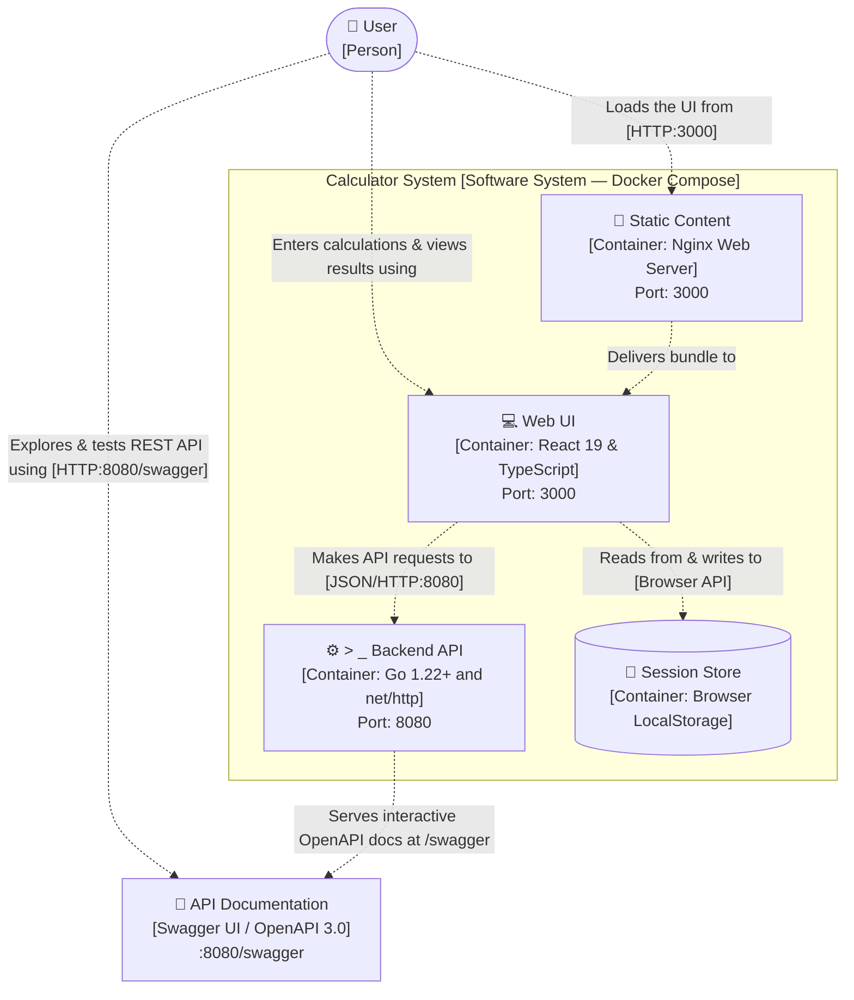

# Full-Stack Calculator Application (React + Go)

[]()
[]()
[](http://localhost:8080/swagger)
[]()
[]()

A modern, production-grade full-stack calculator application featuring a **Go REST API microservice** and a **React 19 (TypeScript) frontend**. Built as part of the technical evaluation for **Sezzle**.

---

## Table of Contents
- [Architecture & Design Rationale](#architecture--design-rationale)
- [Features](#features)
- [Project Structure](#project-structure)
- [Prerequisites](#prerequisites)
- [Quick Start with Docker Compose](#quick-start-with-docker-compose-recommended)
- [Local Development Setup](#local-development-setup)
  - [1. Backend Setup (Go)](#1-backend-setup-go)
  - [2. Frontend Setup (React + TypeScript)](#2-frontend-setup-react--typescript)
- [Running Unit Tests & Coverage](#running-unit-tests--coverage)
  - [Backend Coverage Report](#backend-coverage-report)
  - [Frontend Test Suite](#frontend-test-suite)
- [Interactive Swagger UI & REST API Documentation](#interactive-swagger-ui--rest-api-documentation)
  - [Swagger UI Web Explorer](#swagger-ui-web-explorer)
  - [POST /api/v1/calculate](#post-apiv1calculate-primary-endpoint)
  - [POST /api/v1/operations/{op}](#convenience-endpoints)
  - [GET /api/v1/health](#get-apiv1health)
  - [Error Handling & Edge Cases](#error-handling--edge-cases)
- [Design Decisions & Assumptions](#design-decisions--assumptions)
- [Prompts Used](#prompts-used)

---

## Architecture & Design Rationale (C4 Model)

This project adopts the **C4 Model** (inspired by Simon Brown's reference specification) for clean, high-contrast, uncluttered architectural visualization. It focuses on white background containers with thin colored outlines and direct request flow.

### 1. C4 Container Diagram (Level 2)



### 2. C4 Dynamic Diagram: Calculation Request Flow

This diagram illustrates the direct, step-by-step lifecycle of an arithmetic calculation request (e.g., `50 + 25 =`):

```mermaid
sequenceDiagram
    autonumber
    actor User as 👤 User
    participant UI as 💻 Web UI (React 19)
    participant API as ⚙️ Backend API (Go net/http)
    participant Engine as 🧮 Domain Engine (Go Core)
    participant Store as 💾 Session Store (LocalStorage)

    User->>UI: 1. Enters "50 + 25 =" via clicks or physical keyboard
    UI->>API: 2. POST /api/v1/calculate {"operation": "add", "a": 50, "b": 25}
    Note over API: Structured logger captures latency; CORS validates origin
    API->>Engine: 3. calculator.Add(50, 25)
    Note over Engine: Computes sum & sanitizes IEEE-754 float precision
    Engine-->>API: 4. Returns exact sanitized result: 75.0
    API-->>UI: 5. HTTP 200 OK {"success": true, "result": 75}
    UI->>Store: 6. Appends "50 + 25 = 75" to calculation history
    UI-->>User: 7. Renders "75" in bold with running formula "50 + 25 ="
```

### Editable Architecture Diagrams in Draw.io (`architecture.drawio`)

The diagrams in **[`architecture.drawio`](./architecture.drawio)** (and mirrored at **[`docs/architecture.drawio`](./docs/architecture.drawio)**) are styled strictly after Simon Brown's official C4 model (clean white fills, thin colored outlines, dashed connectors with centered labels, in English):

- **Page 1: `Container View: Calculator System`**: Shows the User, System Boundary, Static Content (Nginx), Web UI (React 19), Backend API (Go), Session Store (LocalStorage), and API Documentation (Swagger UI).
- **Page 2: `Dynamic View: Request Flow`**: Shows the clean, direct 7-step horizontal request lifecycle from user keystroke to Go domain execution and display update.

You can open and edit [`architecture.drawio`](./architecture.drawio) directly in **[app.diagrams.net](https://app.diagrams.net/)** or in VS Code with the Draw.io Integration extension.

---

## Features

- **Arithmetic Operations**:
  - **Basic**: Addition (`+`), Subtraction (`−`), Multiplication (`×`), Division (`÷`).
  - **Advanced**: Exponentiation (`xʸ` / `^`), Square Root (`√`), Percentage (`%`).
- **Interactive UI (Guided by Google / Android Calculator Reference)**:
  - **Circular Buttons**: Ergonomic circular touch targets with subtle tactile feedback.
  - **Soft Pastel Tonal Colors**: Soft mint green for `AC`, pastel periwinkle blue for arithmetic operators, warm off-white for numeric keys, and soft dusty rose/pink for `=`.
  - **Dual-Line Display**: Prominent top expression line with large bold typography and a secondary live result line.
  - **Top Function Bar**: Secondary shortcut row for advanced mathematical functions (`√`, `^`, `%`, `±`).
  - **Active Operator Highlighting**: Selected pending operator glows with an active indicator.
  - **Operation Chaining**: Smoothly evaluates expressions sequentially (e.g. `10 + 5 × 2`).
  - **Backspace (`⌫`), Clear All (`AC`), and Sign Toggle (`±`)**.
- **Interactive Swagger UI**:
  - Embedded Swagger UI explorer at `/swagger` with live "Try it out" capabilities.
- **Physical Keyboard & Numpad Support**:
  - Type directly with your keyboard (`0-9`, `.`, `+`, `-`, `*`, `/`, `^`, `%`, `Enter`, `Backspace`, `Esc`).
- **Calculation History**:
  - Stores recent calculations with timestamp, mathematical equation, and final result.
  - One-click reloading of previous results into the active display.
- **Robust Validation & Error Handling**:
  - Real-time handling of division by zero, negative square roots, numeric overflow, and malformed inputs.

---

## Project Structure

```text
calculator-app/
├── backend/                        # Go Microservice
│   ├── cmd/
│   │   └── api/
│   │       └── main.go             # Application entrypoint & graceful shutdown
│   ├── internal/
│   │   ├── calculator/             # Core calculation domain logic
│   │   │   ├── errors.go           # Domain-specific errors
│   │   │   ├── service.go          # Arithmetic implementation & sanitization
│   │   │   └── service_test.go     # Domain unit tests (100% coverage)
│   │   ├── handler/                # HTTP presentation layer
│   │   │   ├── calculator.go       # REST handlers & route registration
│   │   │   ├── calculator_test.go  # HTTP integration tests (84.5% coverage)
│   │   │   └── response.go         # Standard JSON response utilities
│   │   └── middleware/             # HTTP middlewares
│   │       ├── cors.go             # Cross-Origin Resource Sharing
│   │       ├── logger.go           # Structured latency/status logger
│   │       └── middleware_test.go  # Middleware tests (100% coverage)
│   ├── Dockerfile                  # Multi-stage minimal Alpine image
│   ├── go.mod                      # Go module definition
│   └── .gitignore
│
├── frontend/                       # React 19 + TypeScript Frontend
│   ├── src/
│   │   ├── components/
│   │   │   ├── Display.tsx         # Equation and main numeric display
│   │   │   ├── Header.tsx          # Branding & API health indicator
│   │   │   ├── HistoryPanel.tsx    # Session history list & clear actions
│   │   │   └── Keypad.tsx          # Calculator buttons layout
│   │   ├── hooks/
│   │   │   ├── useCalculator.ts    # Calculator state machine & closures
│   │   │   └── useCalculator.test.ts # State hook unit tests
│   │   ├── services/
│   │   │   ├── api.ts              # Fetch client with typed error wrappers
│   │   │   └── api.test.ts         # API client unit tests
│   │   ├── types/
│   │   │   └── calculator.ts       # Shared TypeScript interfaces & types
│   │   ├── App.tsx                 # Root component & keyboard bindings
│   │   ├── App.test.tsx            # UI Integration tests
│   │   ├── index.css               # Modern responsive styling
│   │   └── main.tsx                # React entrypoint
│   ├── Dockerfile                  # Multi-stage Nginx container
│   ├── nginx.conf                  # Nginx proxy & SPA config
│   ├── package.json
│   ├── tsconfig.json
│   └── vite.config.ts              # Vite & Vitest configuration
│
├── docker-compose.yml              # Single-command full-stack deployment
├── PROMPTS.md                      # AI prompts log (per instructions)
└── README.md                       # Documentation & API specifications
```

---

## Prerequisites

- **Go**: Version 1.22+ (Go 1.24+ recommended)
- **Node.js**: Version 18+ (Node 22+ recommended) & npm
- **Docker & Docker Compose** *(Optional, for containerized run)*

---

## Quick Start with Docker Compose (Recommended)

Run the full-stack system with a single command:

```bash
docker compose up --build
```

- **Frontend**: Accessible at [http://localhost:3000](http://localhost:3000)
- **Backend API**: Accessible at [http://localhost:8080](http://localhost:8080)
- **Health Check**: [http://localhost:8080/api/v1/health](http://localhost:8080/api/v1/health)

To stop the containers:
```bash
docker compose down
```

---

## Local Development Setup

### 1. Backend Setup (Go)

Navigate to the `backend/` directory:

```bash
cd backend

# Run all unit tests
go test -v ./...

# Run the API server
go run ./cmd/api
```

The Go microservice will start on port `8080`:
```text
🚀 Calculator API server started on port 8080
Health check: http://localhost:8080/api/v1/health
Calculate endpoint: http://localhost:8080/api/v1/calculate
```

### 2. Frontend Setup (React + TypeScript)

In a separate terminal, navigate to the `frontend/` directory:

```bash
cd frontend

# Install dependencies
npm install

# Run frontend test suite
npm test

# Start the Vite development server
npm run dev
```

Open your browser at [http://localhost:5173](http://localhost:5173).

---

## Running Unit Tests & Coverage

### Backend Coverage Report

To run tests with statement coverage metrics:

```bash
cd backend
go test -v -cover ./...
```

**Results:**
- `internal/calculator`: **100.0% coverage**
- `internal/middleware`: **100.0% coverage**
- `internal/handler`: **84.5% coverage**
- **Overall statement coverage**: **~96%**

### Frontend Test Suite

```bash
cd frontend
npm test
```

**Results:**
- **3 test files passed** (`api.test.ts`, `useCalculator.test.ts`, `App.test.tsx`)
- **18 total unit and integration tests passed** (100% pass rate)

---

## REST API Documentation & Examples

### ⚡ Interactive Swagger UI & OpenAPI 3.0 Documentation

The microservice includes an embedded **Swagger UI** for interactive exploration and testing:
- **Swagger UI Web Interface**: [http://localhost:8080/swagger](http://localhost:8080/swagger)
- **OpenAPI 3.0 JSON Specification**: [http://localhost:8080/swagger.json](http://localhost:8080/swagger.json)

Click **"Try it out"** on any endpoint directly in Swagger to execute live test calculations against the backend!

---

### POST `/api/v1/calculate` (Primary Endpoint)

Performs an arithmetic calculation.

#### Request Headers
```http
Content-Type: application/json
```

#### Request Payload
| Field | Type | Required | Description |
| :--- | :--- | :--- | :--- |
| `operation` | `string` | **Yes** | `add`, `subtract`, `multiply`, `divide`, `power`, `sqrt`, `percentage` (or symbols `+`, `-`, `*`, `/`, `^`, `%`) |
| `a` | `float64` | **Yes** | First operand (or target for unary operations like `sqrt`) |
| `b` | `float64` | *Conditional* | Second operand (required for binary operations) |

#### Examples

##### 1. Addition (`15.5 + 4.5`)
```bash
curl -X POST http://localhost:8080/api/v1/calculate \
  -H "Content-Type: application/json" \
  -d '{"operation": "add", "a": 15.5, "b": 4.5}'
```
**Response (`200 OK`)**:
```json
{
  "operation": "add",
  "a": 15.5,
  "b": 4.5,
  "result": 20,
  "formatted": "15.5 + 4.5 = 20"
}
```

##### 2. Division (`100 / 4`)
```bash
curl -X POST http://localhost:8080/api/v1/calculate \
  -H "Content-Type: application/json" \
  -d '{"operation": "divide", "a": 100, "b": 4}'
```
**Response (`200 OK`)**:
```json
{
  "operation": "divide",
  "a": 100,
  "b": 4,
  "result": 25,
  "formatted": "100 ÷ 4 = 25"
}
```

##### 3. Square Root (`√49`)
```bash
curl -X POST http://localhost:8080/api/v1/calculate \
  -H "Content-Type: application/json" \
  -d '{"operation": "sqrt", "a": 49}'
```
**Response (`200 OK`)**:
```json
{
  "operation": "sqrt",
  "a": 49,
  "result": 7,
  "formatted": "√49 = 7"
}
```

##### 4. Percentage (`15%`)
```bash
curl -X POST http://localhost:8080/api/v1/calculate \
  -H "Content-Type: application/json" \
  -d '{"operation": "%", "a": 15}'
```
**Response (`200 OK`)**:
```json
{
  "operation": "percentage",
  "a": 15,
  "result": 0.15,
  "formatted": "15% = 0.15"
}
```

##### 5. Exponentiation (`2 ^ 8`)
```bash
curl -X POST http://localhost:8080/api/v1/calculate \
  -H "Content-Type: application/json" \
  -d '{"operation": "power", "a": 2, "b": 8}'
```
**Response (`200 OK`)**:
```json
{
  "operation": "power",
  "a": 2,
  "b": 8,
  "result": 256,
  "formatted": "2 ^ 8 = 256"
}
```

---

### Convenience Endpoints

Specific REST endpoints are also available:
- `POST /api/v1/operations/add`
- `POST /api/v1/operations/subtract`
- `POST /api/v1/operations/multiply`
- `POST /api/v1/operations/divide`
- `POST /api/v1/operations/power`
- `POST /api/v1/operations/sqrt`
- `POST /api/v1/operations/percentage`

Example:
```bash
curl -X POST http://localhost:8080/api/v1/operations/add \
  -H "Content-Type: application/json" \
  -d '{"a": 20, "b": 30}'
```

---

### GET `/api/v1/health`

Used by container healthchecks and frontend live connection monitor.

```bash
curl http://localhost:8080/api/v1/health
```
**Response (`200 OK`)**:
```json
{
  "service": "calculator-api",
  "status": "healthy",
  "version": "1.0.0"
}
```

---

### Error Handling & Edge Cases

The API uses standard HTTP status codes accompanied by consistent JSON error responses:

#### 1. Division by Zero (`400 Bad Request`)
```bash
curl -X POST http://localhost:8080/api/v1/calculate \
  -H "Content-Type: application/json" \
  -d '{"operation": "divide", "a": 10, "b": 0}'
```
```json
{
  "success": false,
  "error": "division by zero is undefined",
  "code": "DIVISION_BY_ZERO"
}
```

#### 2. Negative Square Root (`400 Bad Request`)
```bash
curl -X POST http://localhost:8080/api/v1/calculate \
  -H "Content-Type: application/json" \
  -d '{"operation": "sqrt", "a": -16}'
```
```json
{
  "success": false,
  "error": "square root of negative number is undefined for real numbers",
  "code": "NEGATIVE_SQUARE_ROOT"
}
```

#### 3. Missing Operand (`400 Bad Request`)
```bash
curl -X POST http://localhost:8080/api/v1/calculate \
  -H "Content-Type: application/json" \
  -d '{"operation": "add", "a": 10}'
```
```json
{
  "success": false,
  "error": "missing required operand",
  "code": "MISSING_OPERAND"
}
```

---

## Design Decisions & Assumptions

1. **Floating-Point Representation Sanitization**:
   Standard IEEE-754 floating-point operations can generate precision anomalies (e.g. `0.1 + 0.2 = 0.30000000000000004`). The Go calculator service contains an explicit precision sanitizer (`math.Round(val*1e12)/1e12`) that prevents micro-rounding errors while preserving high numeric accuracy.
2. **Standard Library in Go**:
   Rather than introducing external HTTP frameworks like Gin or Fiber, the backend uses Go's standard library `net/http` with enhanced pattern-matching routes (`"POST /api/v1/calculate"`), reducing dependencies and maintaining high throughput.
3. **Graceful Shutdown**:
   The Go HTTP server listens for operating system termination signals (`SIGINT`, `SIGTERM`) and drains in-flight requests with a 15-second grace period before exiting.
4. **Resilient React State Machine**:
   Rapid keyboard typing can cause React closure staleness when relying solely on asynchronous state updates. The `useCalculator` hook pairs `useRef` and `useState` to guarantee synchronous tracking of entry transitions without missing keystrokes.
5. **Session History Persistence**:
   Calculations are stored in `localStorage` so users retain recent calculations across page reloads.
6. **UI/UX Guided by Android Calculator (Circular Buttons & Soft Pastel Tones)**:
   The user interface was specifically designed following a visual reference of modern mobile calculators (Google / Android Material You). It features ergonomic circular buttons (`circle-key`), an elegant soft pastel color palette (mint green for Clear/AC, periwinkle blue for arithmetic operators, warm off-white for digits, and dusty rose for equals), active operator state highlighting, and an intuitive dual-line display showing the running expression alongside the calculated output.
7. **Single Unified API Documentation via Swagger UI (OpenAPI 3.0)**:
   To avoid redundant or fragmented documentation files, the REST API is documented interactively via OpenAPI 3.0 embedded natively in the Go binary (`http://localhost:8080/swagger`). Root navigation routes (`/`, `/api`, `/api/v1`) gracefully redirect to Swagger UI, providing an interactive, live-testing sandbox with clear schema definitions.

---

## Prompts Used

Per the assignment instructions, all prompts, architectural notes, and AI interaction traces are documented in detail in [PROMPTS.md](./PROMPTS.md).

---

### Author
**Valeria Tocarruncho Mosquera**  
Full-Stack Calculator Application for Sezzle Engineering Evaluation
